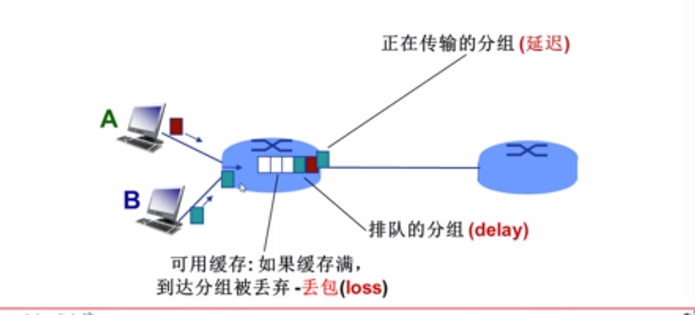
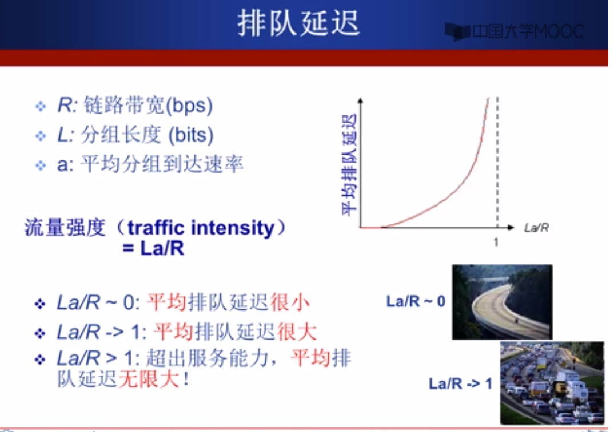
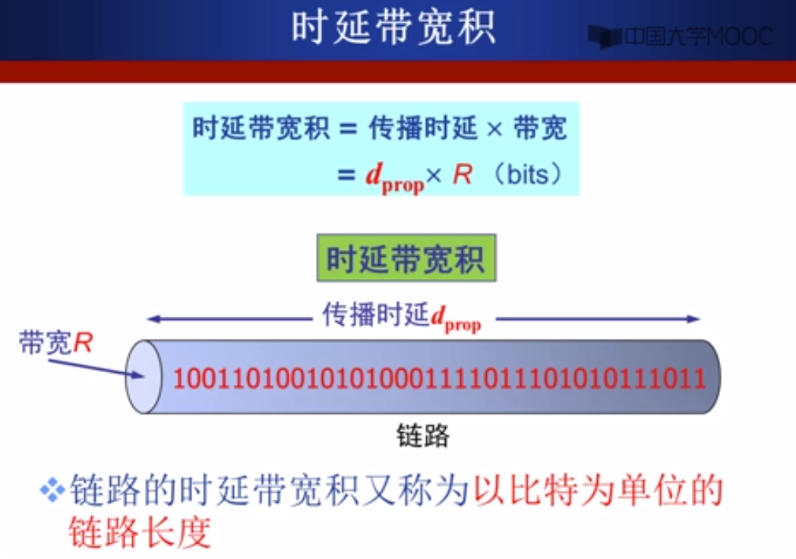
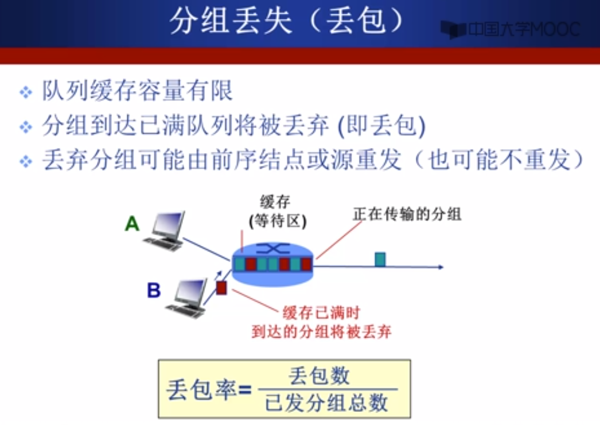
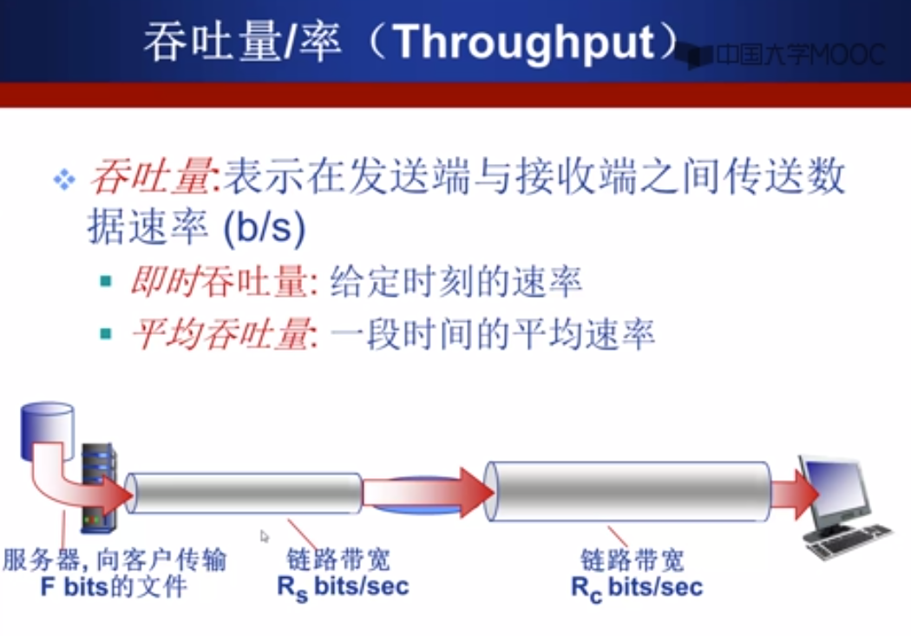

# 计算机网络性能

## 速率

速率即数据率(data rate)或者称为数据传输率或比特率(bit rate)
  - 单位时间（秒）传输信息（比特）量
  - 计算机网络中最重要的一个性能指标
  - 单位: b/s(bps)、kb/s、Mb/s、Gb/s
  - k=10^3、M=10^6、G=10……9

速率往往是指额定速率或标称速率

## 带宽

带宽(bandwith)是数字信道所能传送的最高数据率，单位:b/s(bps)

## 延迟/时延(delay或latency)

Q: 分组交换为什么会发生丢包和时延
A: 分组在路由器缓存中排队

分组到达速率超出输出链路容量时

## 四种分组延迟

1. 结点处理延迟
  - 差错检测
  - 确定输出链路
  - 通常 < msec

2. 排队延迟
  - 等待输出链路
  - 取决于路由器

3. 传输延迟(transmission delay)
  - L：分组长度(bits)
  - R: 链路带宽(bps)
  - d = L/R

4 传播延迟(propagation delay)
  - d: 物理链路长度
  - s: 信号传播速度(~2*10^8m/sec)

## 排队延迟

## 时延带宽积

## 丢包

## 吞吐量/率(throughput)

